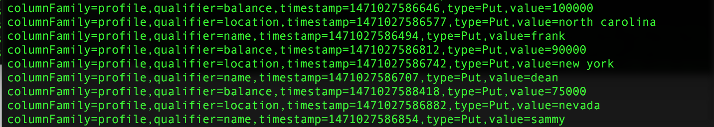
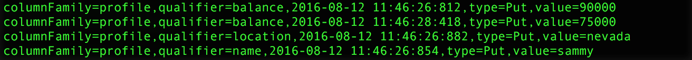

<h3>HBase Snapshot to Spark Example</h3>

This project shows how to analyze an HBase Snapshot using Spark. I used the the HBase <a href="https://hbase.apache.org/apidocs/org/apache/hadoop/hbase/mapreduce/TableSnapshotInputFormat.html">TableSnapshotInputFormat</a> class, which allows allows a MapReduce job to run over a table snapshot.
 
 
Currently, there are a few different ways to process HBase Snapshots (using Hive, Spark, etc), but many of these methods cannot analyze the timestamps at the variable-level. This code shows how to filter/analyze the snapshot timestamps (and all the fields) at a granular level.
 
 Build project: <code>mvn package</code>
 
 Spark: <code>spark-submit --class com.github.zaratsian.SparkHBase.SparkHBase --master yarn-client /tmp/SparkHBaseExample-0.0.1-SNAPSHOT.jar props</code>
 
 
<b>HBase Table</b>: This is the sample table that we started with within HBase. From here we took a snapshot and sent it into HDFS using this syntax: <code>hbase org.apache.hadoop.hbase.snapshot.ExportSnapshot -snapshot customer_info_ss -copy-to hdfs://localhost:8020/tmp/ -mappers 1</code>.

 
 
<b>Output from Spark RDD</b>: This screenshot shows the Spark output, once the HBase Snapshot has been read in to a Spark RDD.

 
 
<b>Filtered Output from Spark</b>: This is a filtered list of records that are more recent (newer) and the user-defined timestamp/threshold value.

 
 
 <b>Versions:</b>
 This code was tested using <a href="http://hortonworks.com/products/data-center/hdp/">Hortonworks HDP</a> 2.4.2.0-258 
 HBase version 1.1.2.2.4.2.0-258
 Spark version 1.6.1
 Scala version 2.10.5 (Java HotSpot(TM) 64-Bit Server VM, Java 1.8.0_40) 

