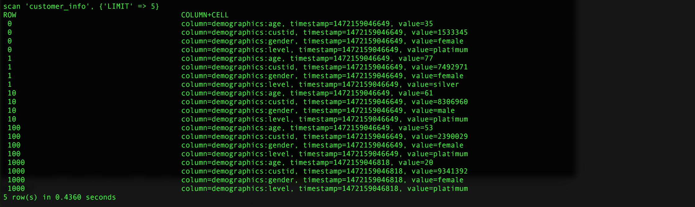
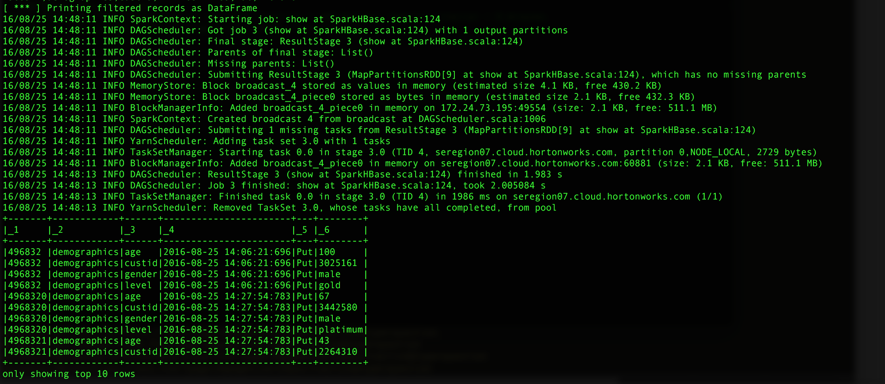

<h3>HBase Snapshot to Spark Example</h3>

This project shows how to analyze an HBase Snapshot within Spark. Currently, there are a few different ways to process HBase Snapshots (using Hive, Spark, etc), but many of these methods do not enable granular analysis of timestamps and records at the variable-level. This example demonstrates how to filter an HBase snapshot based on timestamp within Spark, then write the results to RDD.
 
 
<b>Here's how to run this project:</b>
 
  1. Create an HBase table and populate it with data (or you can use an existing table). If you want, you can use the included python script (write_to_hbase.py), which will create an HBase table called "customer_info" with 1 million records.
  
 
 
  2. Take an HBase Snapshot: <code>snapshot 'customer_info', 'customer_info_ss'</code>
 
 
  3. Load the Hbase Snapshot into HDFS: <code>hbase org.apache.hadoop.hbase.snapshot.ExportSnapshot -snapshot customer_info_ss -copy-to /tmp/ -mappers 2</code>
 
 
  4. Run the included Spark (scala) code against the HBase Snapshot. 
 
 
      a.) Build project: <code>mvn clean package</code>
 
 
      b.) Run Spark job: <code>spark-submit --class com.github.zaratsian.SparkHBase.SparkHBase --master yarn-client /tmp/SparkHBaseExample-0.0.1-SNAPSHOT.jar props</code>
 
 
      c.) NOTE: Adjust the properties within the props file (if needed) to match your configuration

 
The Spark job will read the HBase Snapshot, filter records based on a timestamp threshold (which is set in the props file), the write the resulting RDD back to HDFS.
 
 
<b>HBase Scan:</b> Example output from the HBase scan, showing the a few of the raw records in HBase.

 
 
<b>HBase Filtered output in Spark:</b> Example output from Spark showing the filtered output.

NOTE: The filtered data (as an RDD) will be saved to HDFS at /tmp/hbase_data_from_spark.
 
 
 <b>Versions:</b>
 This code was tested using <a href="http://hortonworks.com/products/data-center/hdp/">Hortonworks HDP</a> 2.4.2.0-258 
 HBase version 1.1.2.2.4.2.0-258
 Spark version 1.6.1
 Scala version 2.10.5 (Java HotSpot(TM) 64-Bit Server VM, Java 1.8.0_40) 
